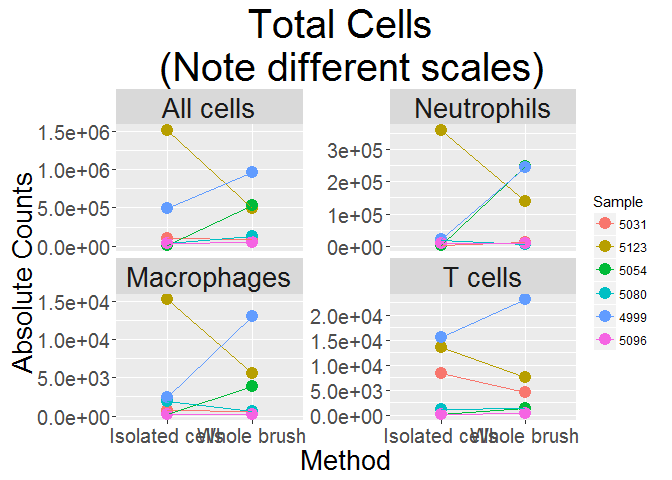
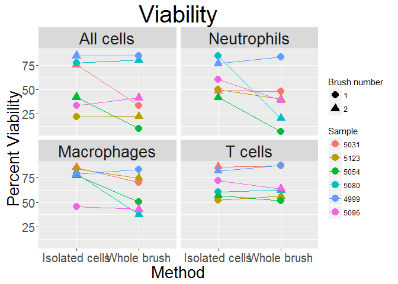
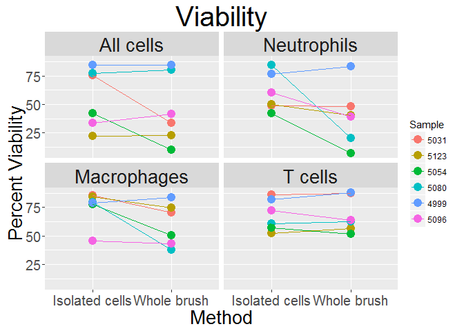
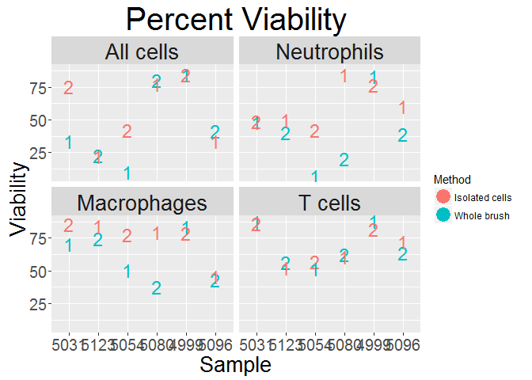
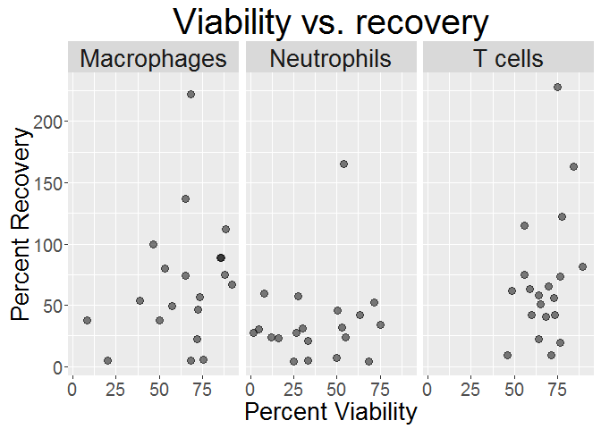
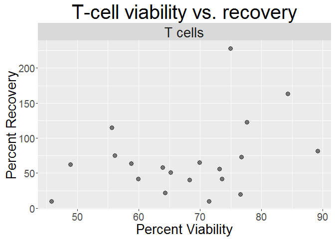
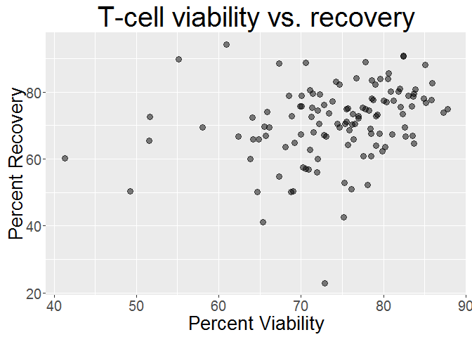

Questions
---------

1.  Can cryopreserving a cytobrush prior to isolating the cells from the brush result in viabilities that are comparable to the traditional cryopreservation method?

2.  Are there differences in recovery for different cell types?

Protocol
--------

### Sample Processing

We collected samples from 6 volunteers, two brushes per volunteer. Cells from one brush were isolated per the usual protocol ("Isolated cells") and the other brush was cryopreserved without isolating the cells ("Whole brush").

For each brush, the transport media was centrifuged and the cells were added to the cryovial with cells isolated from the brush or the whole brush itself. Because cell type and number differ between the first and second brush, we alternated the which brush (\#1 or \#2) was selected to be the "whole brush".

We used the Seattle HES BSA cryopreservative in 5ml cryovials to preserve both the whole brush and isolated cells.

Thawing
-------

Both sample types were thawed in a 37C water bath followed by the dropwise addition of warm RPMI. After thawing,cells were isolated from the whole brush per the usual cytobrush protocol, using room temperature PBS. Cells were stained per the usual staining protocol and analyzed with FACS,Flowjo v.X. and R.

Caveats
-------

Here are some things to think about while looking at the plots

-   5031 and 5123 were thawed and FACS analyzed at the same time, as were 5054 and 5080.

-   4999 brushes were not labeled as \#1 and \#2 so I guessed about which was which.

Conclusions
-----------

1.  Yes, brushes that were frozen whole had viabilities that were comparable to brushes isolated in the usual manner.

2.  Viability for the T cells was consistent between the two methods and it doesn't seem to matter which brush was frozen whole(\#1 or \#2).

In half the samples, Macrophages and Neutrophils from the whole brush didn't survive well, regardless of the brush number. This was most obvious in samples 5054 and 5080 (which were thawed at the same time).

Absolute Counts
---------------

Viability and brush number
--------------------------

Here is that same plot again but without shape mapped to brush number in case that is better

Another way of looking at viability and brush number

Recovery vs viability 

T cells only
============

Spearman's r for correlation between viability and recovery(GAPPS)

<table>
<colgroup>
<col width="16%" />
<col width="5%" />
</colgroup>
<thead>
<tr class="header">
<th align="center">Cell Type</th>
<th align="center">r</th>
</tr>
</thead>
<tbody>
<tr class="odd">
<td align="center">Macrophages</td>
<td align="center">0.26</td>
</tr>
<tr class="even">
<td align="center">Neutrophils</td>
<td align="center">0.13</td>
</tr>
<tr class="odd">
<td align="center">T cells</td>
<td align="center">0.32</td>
</tr>
</tbody>
</table>

Sean's data 

Spearman's r for correlation between viability and recovery(Sean's data)

<table>
<colgroup>
<col width="16%" />
<col width="6%" />
</colgroup>
<thead>
<tr class="header">
<th align="center">Cell.Type</th>
<th align="center">r</th>
</tr>
</thead>
<tbody>
<tr class="odd">
<td align="center">Macrophages</td>
<td align="center">-0.04</td>
</tr>
<tr class="even">
<td align="center">T cells</td>
<td align="center">0.36</td>
</tr>
</tbody>
</table>
