I tried several experiments to find out which conditions will minimize cell loss in the CyTOF protocol. Variables included:

--Tube Material

--Percent PFA

--Tube material with Guava counts and PBS replacing H2O

--Fixation solution

All conditions were done in replicate and are shown as averages unless otherwise noted. All supernatants were decanted (not aspirated).

### Tube material: Polystyrene (PS, normal FACS tubes) and Polypropylene(PP)

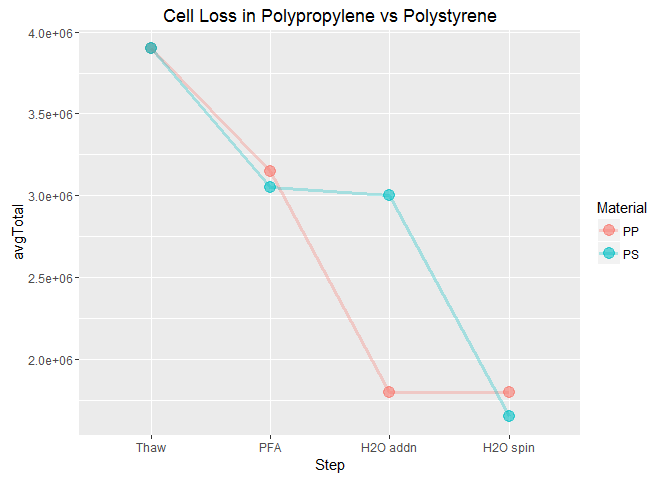

The first plot makes PS look superior at the water resuspension stage, but the replicates for PS count 3 were very different. Here is the raw data with all replicates shown.

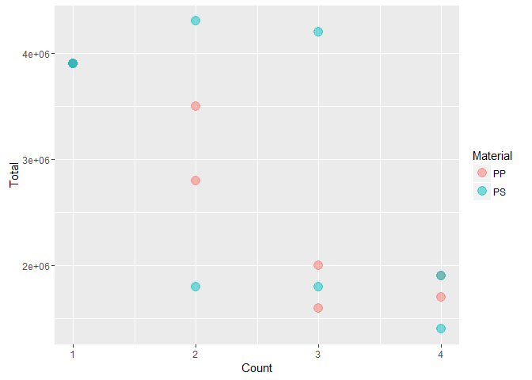

So, there is some variability at count 3 but both materials end up with about the same number of cells.

### Tube Shape

5ml conical tubes vs regular FACS tubes

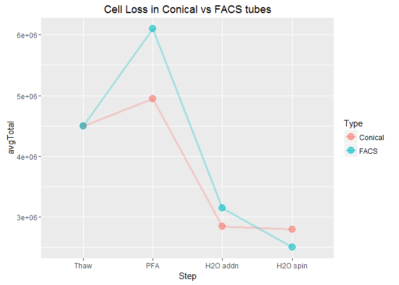 Again, the average is pulled up by a high count for one of the FACS reps at the post-PFA step. Here are the raw data, un-averaged.

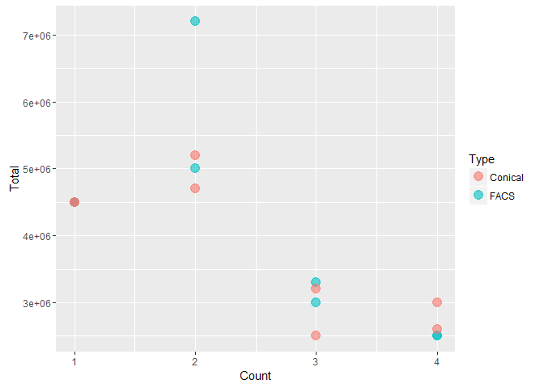

### Percent PFA

I used 4% and 2% PFA (pH 7)

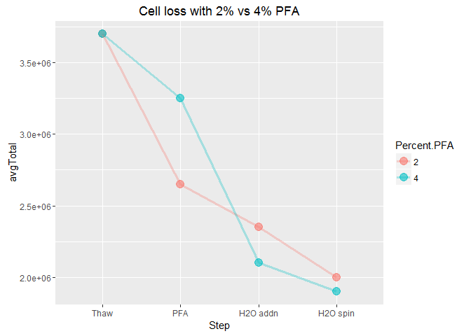

Maybe 4% was a little better but both conditions end up with about the same number of cells in the end after being spun in H2O.

### Fixation Solutions

The different fixation techniques are based on methods from *Current Methods in Immunology* and from the Nolan lab at Stanford. All PFA solutions were 2% in PBS

-   37C PFA: PFA warmed to 37C before adding to the cells

-   FACS Lysing: Only 1X FACS lysing used to fix, no PFA

-   Formaldehyde: 1.6% Formaldehyde in PBS, diluted from a 3% stock (Nolan lab)

-   Frozen PFA: Thawed an old frozen aliquot of PFA (maybe was more fresh?)

Here we counted about 10mins after fixing, washed and resuspended in PBS,then counted again after 2.5hrs and then the next day to see if the fixatives worked better over time.

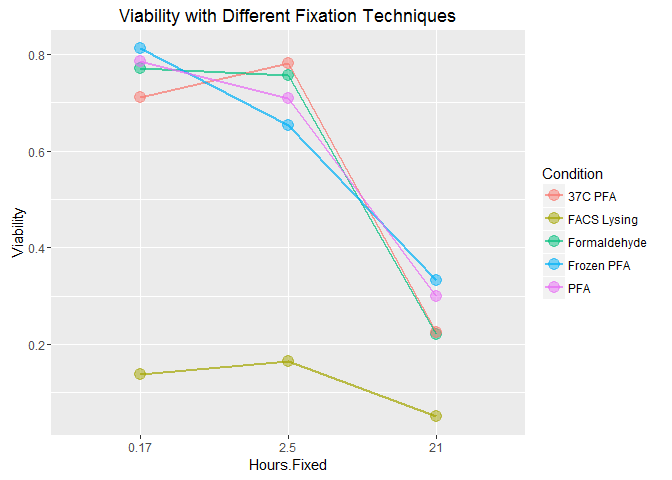

I think something went wrong with the FACS lysing early on, maybe we aliquoted incorrectly or lost many cells during decanting? A plot of total cells at each count shows that we started with many fewer in that aliquot. Clearly a short fixing time does not make the cells appear "dead" using trypan and counting manually. I think it would be worth it to try the Formaldehyde again, diluting directly from our 100% stock. The Nolan lab protocols didn't mention their rationale for using it instead of PFA.

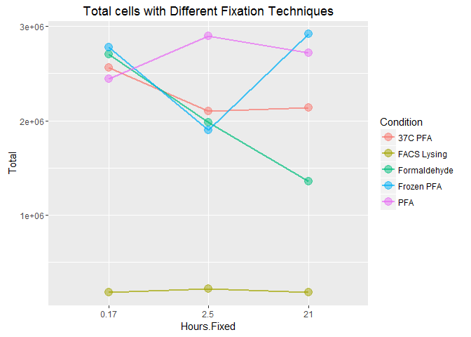

The variability in the counts and the difficulty of determining live vs dead with trypan prompted us to try the guava.

### Guava vs manual counts

Variables:

-- Tube material: PS and PP

-- Final resuspensions and spin: H2O or PBS

-- Counting method: Manual, Guava with manual gate setting, Guava with auto gating ("EasyFit")

"PS PBS" condition is a polystyrene tube with PBS added after fixation instead of H2O.This is more interesting/important with the viability data.

We counted 4 times: after thawing the PBMC, after adding the 2% PFA, after adding water or PBS and after the final spin in water or PBS.We acquired 1k cells on the guava for each count and manually counted ~100-200

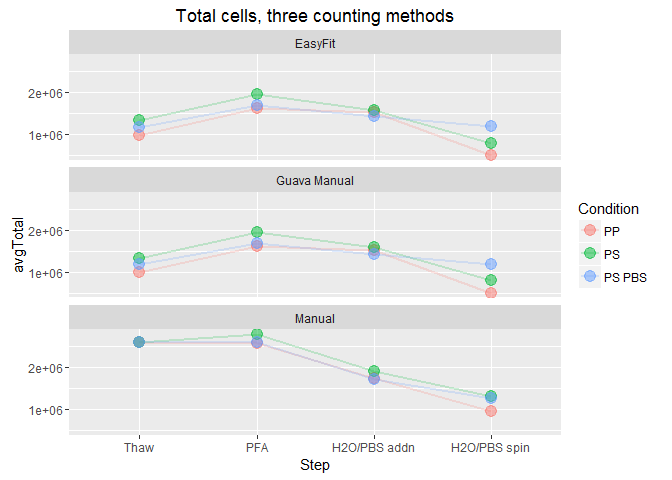

Viability with the three counting methods: For manual counting we differentiated dead vs live with trypan and the used the guava reagent for the others.

Caveats

-   We don't have viability data for the first timepoint for manual counts so that's not shown here.

-   We adjusted the FSC threshold on the Guava after the first count because the FSC seemed to change after fixation.

-   For one of the replicates for the final count of PP, the guava gave a warning message that there were \<10 particles/ul so "accuracy may be compromised."

-   The inital manual count was estimated by dividing the count of all the cells thawed by the number of conditions.

-   Our first two manual counts are high compared with the Guava. The guava may consider some of the things we call cells to be debris. The EasyFit analysis has a "debris index" so we can check that. If we were counting debris intially, it makes sense that the manual vs guava counts get closer together over time, assuming that the debris gets washed away after some washing steps.

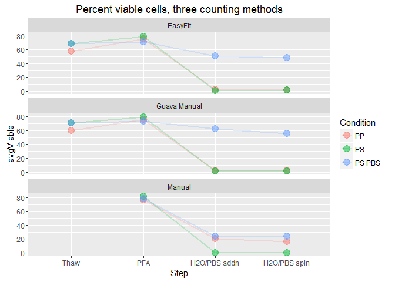

When we did the manual counts we erred on the side of "dead" which count explain the discrepancy between the viability for the PS PBS condition. Regardless, I think this shows that the fixation is not very effective and that the water is probably what makes the cells show up as "dead" when stained with trypan, not the fact that they were exposed to fixative.

### Conclusions

-   The tube shape and material don't seem to matter much.

-   The fixation protocol does not work very well. Cell loss may be due to un-fixed cells being exposed to H2O.

### Next Steps

Things to try

--Repeat experiment with different fixation concentrations,count after 30 min, 2hr, overnight, leave the fixative on overnight, no washing.

-- 2% and 4% PFA (from our lab), 2% fresher PFA from endopoints, 1.6% formaldehyde and FACS lysing again

-- Keep the resuspend in H2O step for comparison?

--Count manually and by guava

-- forget about the tube material for now

-- Not totally related to the CyTOF goal but it would be interesting to filter some of the cells and see how the guava counts change.

### Continued experimentation

Conditions

-   2% PFA: Hladik, Endpoints and 5th floor x 2 (pH 7 and 7.4)

-   4% PFA: Hladik, Endpoints and 5th floor x 2 (pH 7 and 7.4)

-   FACS lysing: Endpoints and 5th flr

Counted after thawing, 10 min after fixation, 1 hr after fixation, 21 hr after fixation and after H2O spin

Counted with Guava for all counts and manually for all except post H2O

Here is the guava data, first the PFA conditions, colored by source and facetted by pH and percent PFA.

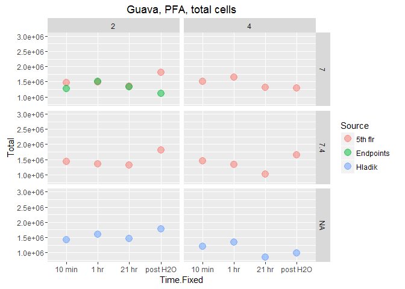 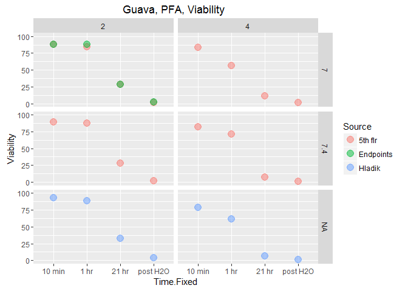 It looks like source doesn't matter so let's remove that variable...

Conclusions

-   2% PFA was maybe a little better in terms of total cells

-   4% PFA seemed to lower the viability more quickly than 2%. After 1hr, viab was still quite high for 2% but dropped more for 4%. Same with the count at 21hr. This seems important if we want them to be as fixed as possible before adding H2O

-   I don't see much of a difference between the different pH's. So it probably doesn't hurt to adjust the pH to 7.4 but not terrible if it is at 7?

-   Our old PFA seems just as good as the endpoints newer solution.

Here are the same things for the FACS lyse conditions, colored by source.

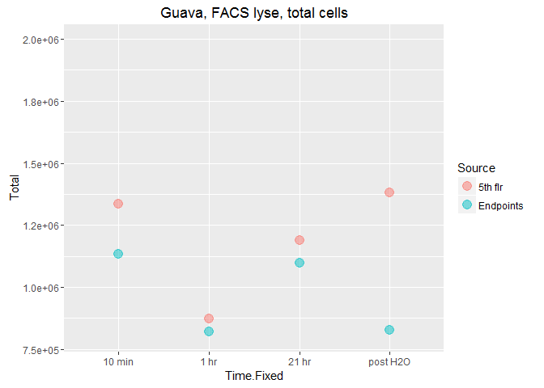 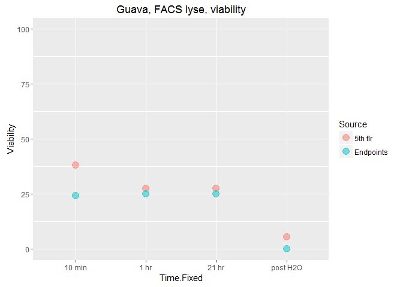

Conclusions

-   FACS lyse gets viability down to ~25% after 10mins while the PFA took overnight to get there. But there doesn't seem to be any change until the water is added. I'll do both next time.

-   I don't know why the total cells varied so much. Maybe we didn't resuspend evenly?

Differences between manual and guava counts for total cells, first for the PFA conditions, then the FACS lysing conditions.

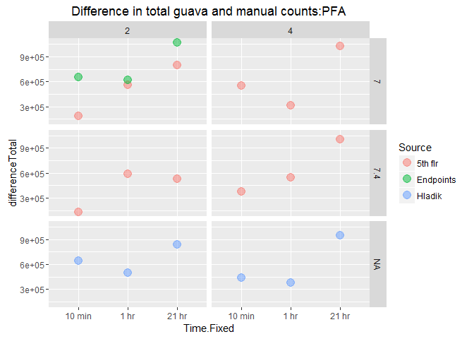  Greatest differences between manual and guava counts for totals were at the 21hr count. 4 conditions had a count difference of \>9E5. Now a comparison of live counts vs dead counts to see where the biggest difference was.

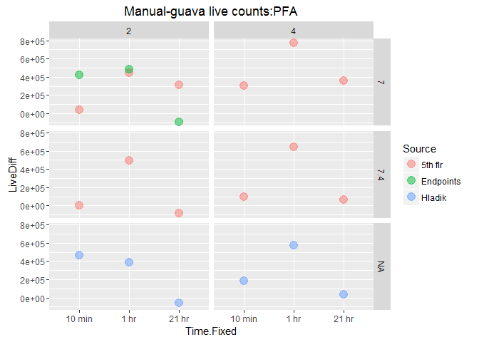 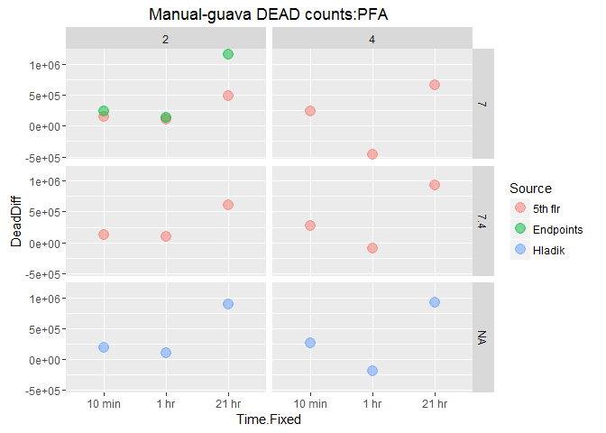

Here's the mean of the live and dead count differences

    ## Source: local data frame [7 x 4]
    ## Groups: Percent, pH [?]
    ## 
    ##   Percent     pH    Source mean(LiveDiff)
    ##    (fctr) (fctr)    (fctr)          (dbl)
    ## 1       2      7   5th flr       266800.3
    ## 2       2      7 Endpoints       272226.1
    ## 3       2    7.4   5th flr       137857.5
    ## 4       2     NA    Hladik       265580.1
    ## 5       4      7   5th flr       481807.5
    ## 6       4    7.4   5th flr       271255.6
    ## 7       4     NA    Hladik       263704.0

    ## Source: local data frame [7 x 4]
    ## Groups: Percent, pH [?]
    ## 
    ##   Percent     pH    Source mean(DeadDiff)
    ##    (fctr) (fctr)    (fctr)          (dbl)
    ## 1       2      7   5th flr       250083.8
    ## 2       2      7 Endpoints       510577.8
    ## 3       2    7.4   5th flr       276837.5
    ## 4       2     NA    Hladik       394402.1
    ## 5       4      7   5th flr       150454.8
    ## 6       4    7.4   5th flr       373345.7
    ## 7       4     NA    Hladik       325648.4

Manual live counts were most different from guava counts after 1hr and the dead counts were most different at the 21hr count.In most cases, the manual counts were higher than the guava but not always.

\`\`\`
