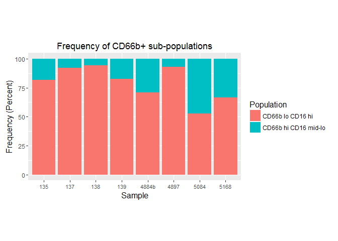

As of 5Jan16 we have 5 good flow samples using Rena's neutrophil panel and 4 successful CyToF samples from April-May 2015. The CyToF samples were cytobrushes from HVTN clinic and the flow samples are from Dr. Adams-Waldorf. The CyToF panel contained all the same markers as the flow panel, plus a lot more.

To generate the data used below,I used the following gating schemes:

CyToF

-   singlets (intercalator1 vs event length)
-   CD45+ (intercalator1 vs CD45)
-   live (intercalator1 vs Cisplatin)
-   neutrophils (CD14 vs CD66b)
-   neutrophil subsets (CD16 vs CD66b)

Flow

-   everything but beads (fsc vs ssc)
-   singlets (fscH vs fscA)
-   CD45+ (SSC vs CD45)
-   live (SSC vs L/D)
-   neutrophils (CD14 vs CD66b)
-   neutrophil subsets (CD16 vs CD66b)

Then I made freq-of-parent tables from those gates to use here for plotting.

